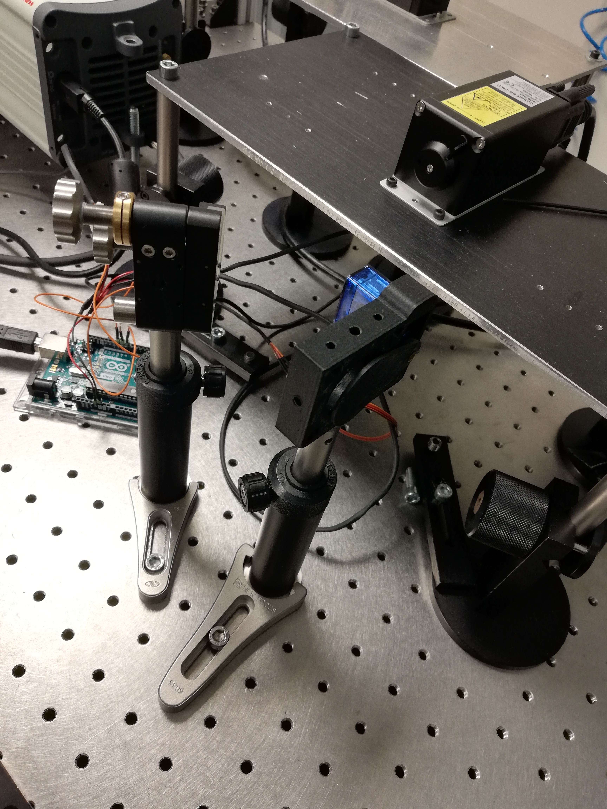

# shutter_controler_py
Contain controller for 3D printed beam-blockers, the application is done with pyQT

how to use:

1-charge into the arduino the file: 
servo_retunr_pos.ino

2-run the file start-app.py
The application is completelly functional and can be compile with pyinstaller if it need to be installed. 

The 3D printed shutter files can be found in thinguiverse.

<caption>
<b> 3D printed Suhtters. 
</caption>

  
Enjoy; I would love If someone giveme a star¡¡
